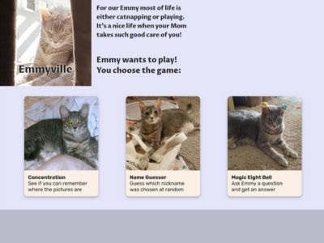

# Emmyville  
This is a personal site just for fun. It's theme is all about our cat, Emmy.  
It is a work-in-progress as I'll keep adding to it over time, when I get the chance.  
  
At this moment it has three games available to play.  
1. Concentration is a timed game. The user flips over two tiles at a time and tries to remember where they saw the same picture to match them.  
2. Name Guess has the user making guesses about one of the many terms of endearment we use.  
3. Magic 8-ball responds to a yes or no question like the old toy, but it's been cat-ified.  
  
At this moment there are four webpages: the main page and the three game pages.  
It uses HTML, CSS, vanilla JavaScript and a boatload of local images.  
  
I plan to keep iterating on it. I want add more games and maybe some animation.  
  
  
